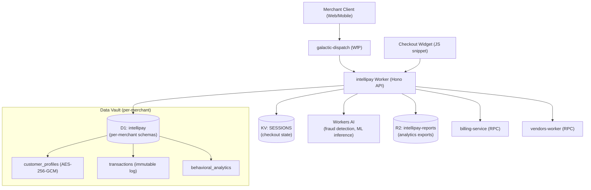

# Architecture

_Last updated: 2026-06-13_

## Overview

Intellipay is an AI-first commerce intelligence platform built on Cloudflare Workers. It provides per-merchant isolated data vaults, checkout optimization via Workers AI, and a unified analytics API. Deployed as a WfP (Workers for Platforms) product on the Galactic Platform dispatch namespace.

## System Diagram

## Key Design Decisions

- **Per-merchant D1 isolation**: each merchant gets a separate D1 database or scoped schema — no cross-merchant data sharing (ADR-3 from galactic platform)
- **AES-256-GCM field-level encryption**: uses `@g-a-l-a-c-t-i-c/cloudflare` encryption utilities for all PII fields
- **Workers AI for ML**: fraud detection and checkout optimization run as Workers AI inference calls (<100ms target)
- **Shadow Mode via `ctx.waitUntil()`**: traffic mirroring for zero-risk migration uses Cloudflare's deferred execution primitive

## Stack

| Layer | Technology |
|-------|-----------|
| API framework | Hono |
| Runtime | Cloudflare Workers |
| Database | Cloudflare D1 (SQLite) |
| Session storage | Cloudflare KV |
| Object storage | Cloudflare R2 |
| ML inference | Cloudflare Workers AI |
| Platform packages | `@g-a-l-a-c-t-i-c/platform-sdk`, `@g-a-l-a-c-t-i-c/cloudflare`, `@g-a-l-a-c-t-i-c/tier-guard` |
| Auth | API key + JWT (RBAC) |
| Encryption | AES-256-GCM |
