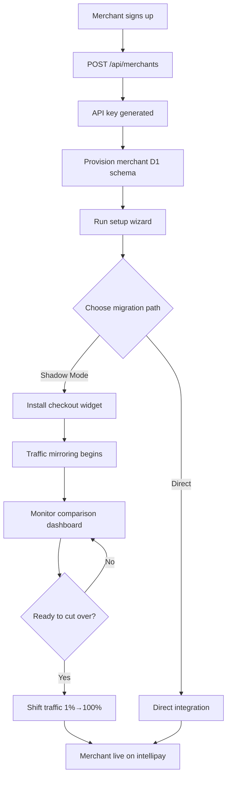
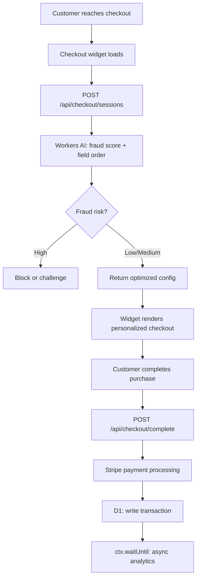
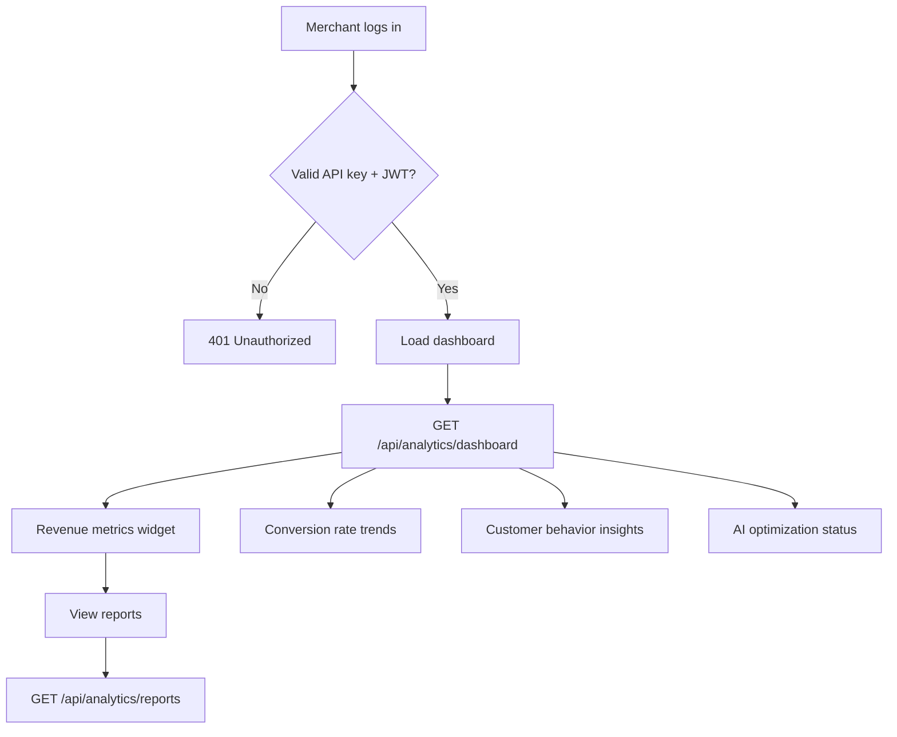
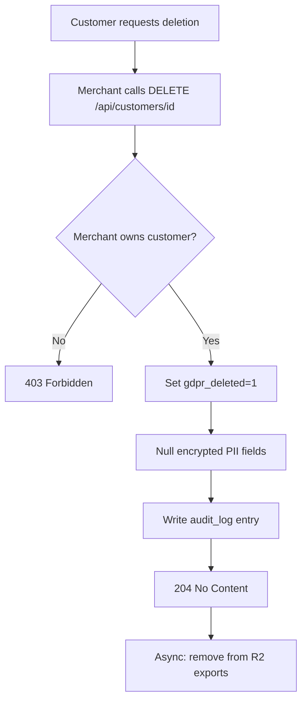

# User Flows

_Last updated: 2026-06-13_

## Merchant Onboarding Flow

```mermaid
flowchart TD
    A[Merchant signs up] --> B[POST /api/merchants]
    B --> C[API key generated]
    C --> D[Provision merchant D1 schema]
    D --> E[Run setup wizard]
    E --> F{Choose migration path}
    F -->|Shadow Mode| G[Install checkout widget]
    F -->|Direct| H[Direct integration]
    G --> I[Traffic mirroring begins]
    I --> J[Monitor comparison dashboard]
    J --> K{Ready to cut over?}
    K -->|Yes| L[Shift traffic 1%→100%]
    K -->|No| J
    L --> M[Merchant live on intellipay]
    H --> M
```

## Checkout Optimization Flow

```mermaid
flowchart TD
    A[Customer reaches checkout] --> B[Checkout widget loads]
    B --> C[POST /api/checkout/sessions]
    C --> D[Workers AI: fraud score + field order]
    D --> E{Fraud risk?}
    E -->|High| F[Block or challenge]
    E -->|Low/Medium| G[Return optimized config]
    G --> H[Widget renders personalized checkout]
    H --> I[Customer completes purchase]
    I --> J[POST /api/checkout/complete]
    J --> K[Stripe payment processing]
    K --> L[D1: write transaction]
    L --> M[ctx.waitUntil: async analytics]
```

## Merchant Dashboard Flow

```mermaid
flowchart TD
    A[Merchant logs in] --> B{Valid API key + JWT?}
    B -->|No| C[401 Unauthorized]
    B -->|Yes| D[Load dashboard]
    D --> E[GET /api/analytics/dashboard]
    E --> F[Revenue metrics widget]
    E --> G[Conversion rate trends]
    E --> H[Customer behavior insights]
    E --> I[AI optimization status]
    F --> J[View reports]
    J --> K[GET /api/analytics/reports]
```

## GDPR Customer Deletion Flow

```mermaid
flowchart TD
    A[Customer requests deletion] --> B[Merchant calls DELETE /api/customers/id]
    B --> C{Merchant owns customer?}
    C -->|No| D[403 Forbidden]
    C -->|Yes| E[Set gdpr_deleted=1]
    E --> F[Null encrypted PII fields]
    F --> G[Write audit_log entry]
    G --> H[204 No Content]
    H --> I[Async: remove from R2 exports]
```
