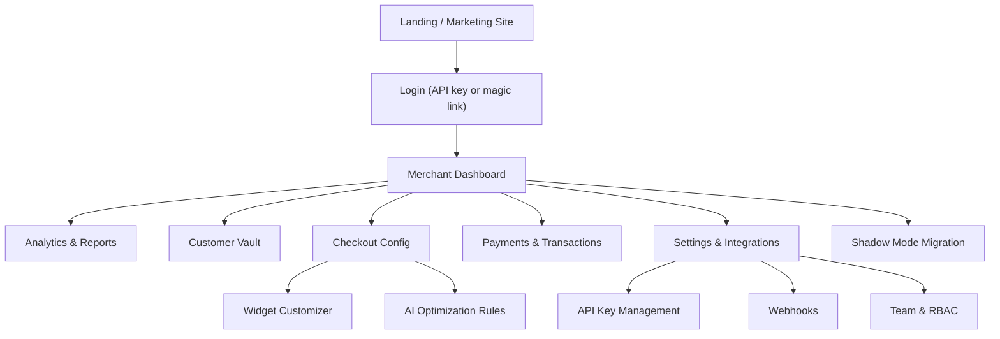
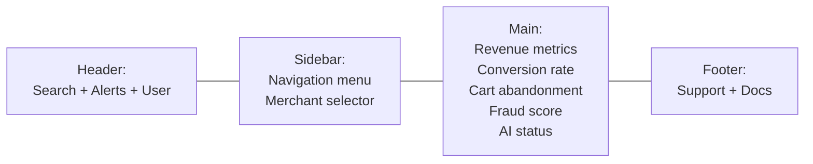
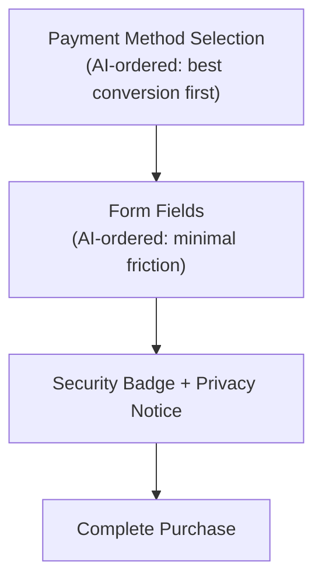
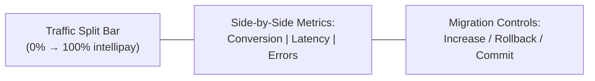

# UI/UX Wireframes

_Last updated: 2026-06-13. Mermaid diagrams — render in GitHub or any Mermaid-compatible viewer._

## Navigation Structure

## Dashboard Layout

## Checkout Widget (Embedded in Merchant Site)

## Shadow Mode Migration Dashboard

